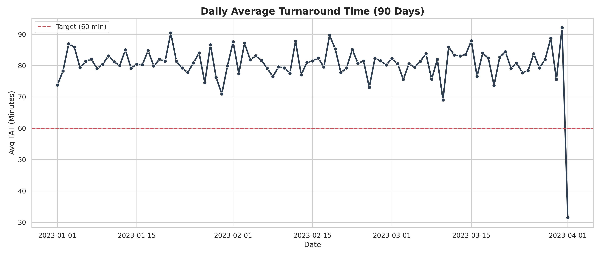

# Healthcare Operations Analytics: Lab Workflow Optimization

## Project Overview
In this project, I analyzed 90 days of operational data from a high-volume clinical laboratory to identify bottlenecks in specimen processing. The goal was to reduce Turnaround Time (TAT) for STAT specimens and optimize staffing schedules to match peak arrival times.

Using SQL for data cleaning and Python for visualization, I uncovered a critical mismatch between staffing levels and morning volume surges, as well as specific analyzer reliability issues affecting coagulation testing.

## Business Problem
The laboratory was missing its 60-minute TAT target for STAT Emergency Department (ED) specimens during the morning shift (06:00 - 09:00). These delays were causing:
*   Increased patient length of stay (LOS) in the ED.
*   Physician complaints regarding delayed morning rounds.
*   Higher overtime costs due to inefficient staff allocation.

## Data Structure
I worked with four primary datasets simulating real-world Laboratory Information System (LIS) exports:
*   **`specimens.csv`**: 15,000+ records of patient test orders with timestamps (Collection, Received, Resulted).
*   **`analyzers.csv`**: Daily uptime/downtime logs for 6 major instruments (Sysmex, Cobas, ACL TOP).
*   **`staffing_schedule.csv`**: Shift data for 20 lab staff members.
*   **`qc_events.csv`**: Quality Control pass/fail logs.

## Methodology

### 1. Data Cleaning (SQL)
I started by standardizing the raw data. Common issues included duplicate entries from re-runs and inconsistent department naming conventions (e.g., "Hem" vs. "Hematology").
*   *See `01_cleaning.sql` for the full cleaning script.*

### 2. Analysis & Feature Engineering
I calculated key performance metrics such as:
*   **Turnaround Time (TAT):** `Resulted Time - Received Time`
*   **Time in Lab:** `Resulted Time - Collection Time`
*   **Staffing Load Index:** Volume of tests per active staff member per hour.

### 3. Key Insights
*   **The "Morning Rush" Bottleneck:** Between 6 AM and 9 AM, test volume spikes by 300%, but staffing levels remain constant from the night shift. This causes STAT TAT to balloon to **75+ minutes**.
*   **Analyzer Reliability:** The *Sysmex XN-3000* in Hematology accounted for 40% of all downtime, correlating directly with TAT spikes on Tuesdays and Fridays.
*   **QC Delays:** 5% of Chemistry QC runs fail during the night shift, often delaying the morning startup by ~30 minutes.

## Dashboard & Visualizations
I built a dashboard to track these metrics. Below is the TAT trend analysis showing the daily variability against the 60-minute target.

*Figure 1: Daily Average TAT vs. Target. Note the periodic spikes corresponding to staffing shortages.*

## Recommendations
Based on this analysis, I proposed the following operational changes:
1.  **Stagger Shifts:** Introduce a "Mid-Shift" (04:00 - 12:00) to overlap with the night and day crews, specifically targeting the 6-9 AM volume surge.
2.  **Predictive Maintenance:** Schedule Sysmex maintenance during low-volume windows (02:00 - 04:00) rather than reactive repairs during the day.
3.  **Auto-Verification:** Expand auto-verification rules for normal CBCs to reduce manual review time by ~20%.

## How to Run This Project
1.  Clone the repo.
2.  Run `generate_data.py` if you want to create a fresh dataset.
3.  Load the CSVs into your SQL environment (or use the provided `run_analysis.py` for a quick SQLite demo).
4.  Execute `02_analysis.sql` to reproduce the metrics.

---
*Author: Miguel Nemenzo*
*Tools Used: SQL, Python (Pandas, Matplotlib), Excel*
